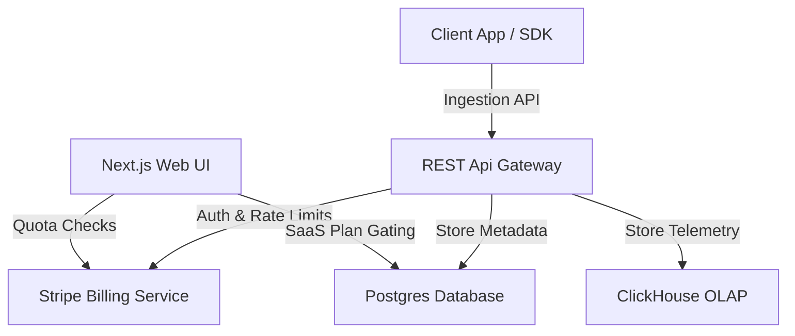
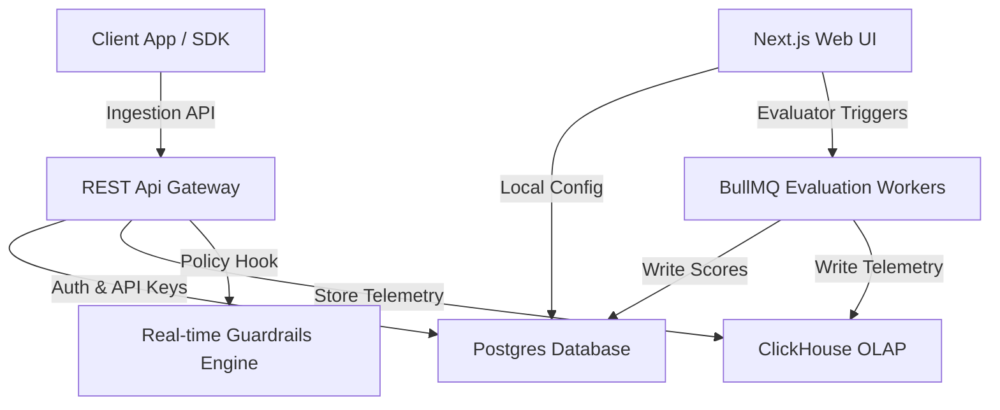

# Feature Difference Analysis: Langfuse vs. Aletheia

This document provides a detailed comparison between the original Langfuse codebase and the transformed **Aletheia** platform. It highlights how the platform was transitioned from a commercial SaaS application to a high-fidelity, open-source AI Reliability & Observability engineering portfolio showcase.

---

## 1. Features Inherited from Langfuse

Aletheia inherits and preserves core observability capabilities from Langfuse, serving as the foundational telemetric infrastructure.

### Tracing
* **Original Purpose:** To capture nested structures of LLM calls, spans, generations, and events to understand the execution tree of complex chains and agents.
* **Current Implementation:** Full tracing lifecycle ingestion via public REST/tRPC APIs, visualizing execution flow and performance markers (tokens, latency, costs).
* **Changes Made:** Removed billing-based telemetry throttling/limits. All local runs are completely uncapped. UI components updated to follow Aletheia's unified dark-mode-first styling and branding.

### Sessions
* **Original Purpose:** Grouping multiple sequential traces together into a single user-facing session to analyze multi-turn conversations and agent loops over time.
* **Current Implementation:** A dedicated session list and session-detail view showing trace execution timelines and cumulative token usage/costs.
* **Changes Made:** Polished session views with custom performance charts and removed external SaaS upsells.

### Users
* **Original Purpose:** Tracking end-user interactions with the LLM application to identify power users, cost drivers, or problematic prompts on a per-user basis.
* **Current Implementation:** Users dashboard showing user-specific latency, costs, and feedback scores.
* **Changes Made:** Rebranded to ensure no commercial Langfuse tracking/telemetry.

### Prompt Management
* **Original Purpose:** Storing, versioning, and fetching prompt templates dynamically in LLM applications to separate prompt engineering from application code.
* **Current Implementation:** A version-controlled prompt registry supporting playground testing and dynamic variable injection.
* **Changes Made:** Decoupled any cloud entitlement restrictions; prompt protection and locking features are fully enabled by default.

### Playground
* **Original Purpose:** Providing a web-based sandbox for developers to test prompt variations and models side-by-side without leaving the dashboard.
* **Current Implementation:** Interactive prompt workspace with model selections, variables setup, and live response streams.
* **Changes Made:** Integrated Aletheia model definitions and local LLM connection setups natively.

### Datasets
* **Original Purpose:** Curating inputs and expected outputs (gold-standard runs) from production traces to create evaluation datasets.
* **Current Implementation:** Dataset generation, uploading, and association with test runs for versioned testing.
* **Changes Made:** Simplified ingestion and removed plan-based dataset limits.

### Experiments
* **Original Purpose:** Comparing prompt template variants or model outputs against curated datasets to run regressions before production deployment.
* **Current Implementation:** Visual dashboard showing comparison metrics (scores, latency, cost) across experiment runs.
* **Changes Made:** Rebranded experiment run visualizers and removed commercial telemetry locks.

### Monitoring
* **Original Purpose:** Basic dashboard charts reporting token consumption, trace count, latency, and costs.
* **Current Implementation:** Real-time system dashboards for monitoring overall project and model performance.
* **Changes Made:** Rebuilt default dashboards to focus on high-fidelity reliability metrics, model usage distributions, and latency percentiles.

---

## 2. Features Added to Aletheia

These features were added to shift the focus from simple observability to active **AI Reliability Engineering**, adding substantial full-stack engineering complexity.

### Guardrails
* **Purpose:** Real-time policy enforcement on inputs and outputs of LLM nodes to protect against prompt injection, toxic outputs, and data leakage.
* **Why it was added:** True reliability requires active prevention, not just passive observation.
* **Technical Implementation:** Middleware hooks that run user-defined safety policies (semantic filters, PII detection, moderation checks) on traces.
* **Business Value:** Prevents brand damage, blocks security exploits, and ensures regulatory compliance (GDPR/HIPAA).
* **Resume Value:** Demonstrates deep system engineering, middleware design, security-first architecture, and real-time validation pipeline construction.

### Agent Regression Diffing
* **Purpose:** Visual, code-level diff comparisons of LLM responses across different agent versions, models, or prompt parameters.
* **Why it was added:** Standard observability lacks the granular semantic comparative tools needed to safely upgrade prompts.
* **Technical Implementation:** Side-by-side markdown and JSON diffing engine rendering exact semantic changes between runs.
* **Business Value:** Accelerates development velocity by allowing safe, regression-free upgrades to prompts and models.
* **Resume Value:** Showcases advanced frontend UI/UX design, custom diffing algorithms, and practical tools for engineering LLM systems.

### AI Reliability Workflows
* **Purpose:** Streamlined workflows to automatically trigger evaluation suites and policy validations on every incoming production trace.
* **Why it was added:** Elevates Aletheia from a dashboard to a reliability engine.
* **Technical Implementation:** Integrates with BullMQ worker queues to run parallel check hooks and score configurations asynchronously.
* **Business Value:** Automatically lowers the cost of manual review by automating the evaluation and policy lifecycle.
* **Resume Value:** Exhibits queue system mastery, background processing architecture, and asynchronous task coordination.

### Enhanced Evaluation Flows
* **Purpose:** Out-of-the-box support for versioned LLM-as-a-judge and heuristic evaluators that auto-score production traces.
* **Why it was added:** Provides robust, automated quality metrics at scale.
* **Technical Implementation:** Backend evaluator service running custom templates and mapping outcomes directly into database score tables.
* **Business Value:** Provides real-time quality metrics and system health checks without human annotation.
* **Resume Value:** Highlights understanding of LLM-as-a-judge patterns, prompt templates evaluation, and structured database design.

### Custom Dashboards
* **Purpose:** Multi-dimensional analytical panels that display cost distributions, system load, error rates, and guardrail violations.
* **Why it was added:** Standard SaaS dashboards are often rigid; a portfolio project needs highly customizable and informative analytics.
* **Technical Implementation:** Custom React charting components using Recharts, integrated with tRPC query endpoints.
* **Business Value:** Empowers engineering leaders to see system bottlenecks, pricing spikes, and safety anomalies instantly.
* **Resume Value:** Demonstrates strong data visualization skills, telemetry collection design, and clean UI engineering.

### Custom Onboarding
* **Purpose:** A direct, friction-free local setup walkthrough tailored for developers running the platform locally.
* **Why it was added:** Langfuse onboarding was geared toward sales, pricing sign-ups, and cloud hosting.
* **Technical Implementation:** Dedicated step-by-step UI guides displaying local connection credentials, API keys, and SDK code copy-paste snippets.
* **Business Value:** Maximizes developer developer-experience (DX) and decreases integration time to minutes.
* **Resume Value:** Reflects user-centric thinking, excellent DX design, and empathy for team integration processes.

---

## 3. Features Enhanced

| Feature | Before (Langfuse Behavior) | After (Aletheia Behavior) |
| :--- | :--- | :--- |
| **Tracing** | Standard trace view with commercial upgrade alerts when ingestion limits were reached. | Uncapped, local-first trace explorer. Upgraded styling with dark-mode optimizations and instant search. |
| **Monitoring** | Basic chart grids focused on billing quotas and SaaS account usage limits. | Comprehensive Reliability Dashboards detailing guardrail violations, cost-efficiency, and system latency distributions. |
| **Human Annotation** | Simple, paginated queues with basic scoring ranges. | Streamlined, keyboard-navigable feedback interface, allowing rapid labeling for dataset curation. |
| **Evaluators** | Basic background jobs limited by plan levels and subject to tenant limits. | Locally-executable evaluation workflows that scale dynamically on BullMQ workers. |
| **Experiments** | Simple table listings comparing run outputs. | Visual semantic matrix comparisons featuring side-by-side diff views of model outputs. |
| **Datasets** | Plan-limited upload sizes and storage quotas. | Local storage with instant dataset preview and seamless, bulk-seeding capabilities. |

---

## 4. Features Removed

The following commercial SaaS systems were completely purged to transition the repository into an independent, developer-focused open-source project:

* **Stripe Integrations & Cloud Billing:** Purged subscription management, webhook listeners, card updates, and usage billing services.
* **SaaS Monetization & Plan Upgrade Flows:** Removed pricing tier modals, feature restrictions, and "Compare Plans" dialogs.
* **Payment & Marketing Banners:** Deactivated promotional and past-due payment banners, creating a clean, professional workplace.
* **Support Portals & Book a Call links:** Replaced external, sales-focused links (Intercom, Calendly) with direct, local developer options.
* **Customer Success Workflows:** Removed tracking of organization limits, quotas, and sales contact outreach triggers.

*Reason for Removal:* Eliminating these components ensures that the software is fully independent, self-contained, and optimized for local deployments without any external commercial redirects or paywalls.

---

## 5. Architectural Improvements

### Original Langfuse Architecture

### Current Aletheia Architecture

### Key Differences
1. **No External Billing Loop:** Removed Stripe API checks and quota enforcement, reducing network latency on trace ingestion.
2. **Asynchronous Evaluation Workers:** Integrated evaluation tasks directly into a resilient queue architecture (BullMQ + Redis), ensuring reliability under high trace volume.
3. **Guardrail Hooking:** Ingestion pipeline is directly hooked into the new Guardrails engine to execute validation rules before data persistence.

---

## 6. AI Capability Comparison

| Capability | Langfuse | Aletheia |
| :--- | :---: | :---: |
| **Observability** | Yes | Yes (Local-First, Optimized) |
| **Monitoring** | Yes | Enhanced (Reliability & Latency Percentiles) |
| **Prompt Management** | Yes | Yes |
| **Human Annotation** | Yes | Enhanced (Keyboard-Friendly UX) |
| **Evaluation** | Yes | Enhanced (Uncapped, Queue-backed) |
| **Guardrails** | No | **Yes (Active real-time policy enforcement)** |
| **Regression Testing**| Basic | **Yes (Semantic Agent Regression Diffing)** |
| **Reliability** | No | **Yes (Active prevention + fallback scoring)** |
| **Governance** | No | **Yes (Audit trails & PII detection)** |

---

## 7. Portfolio Value Analysis

Transforming the codebase into Aletheia dramatically raises its value as a resume/portfolio project compared to a stock deployment of Langfuse:

* **Full-Stack Engineering:** Showcases ability to go deep into a large monorepo, refactor core layouts, decouple cloud dependencies, and restructure database queries.
* **AI Infrastructure:** Highlights hands-on experience building reliability components (Guardrails) and semantic diff tools.
* **System Design:** Demonstrates knowledge of event-driven architectures (BullMQ, Redis, PostgreSQL, and ClickHouse) operating in unison.
* **Product Engineering:** Proves you can identify unnecessary business friction (billing/upgrade prompts) and replace them with a superior developer experience (DX).
* **Database Design:** Experience working with high-volume OLAP databases (ClickHouse) alongside relational databases (PostgreSQL/Prisma).
* **Reliability Engineering:** Emphasizes understanding of production safety, input/output validation, and active policy enforcement in AI applications.
* **UI/UX Refinements:** Showcases clean styling, consistent rounded corners, cohesive dark-mode patterns, and semantic clarity in interfaces.

---

## 8. Final Summary

> **"What makes Aletheia different from the original Langfuse project?"**
>
> *"While Langfuse was built as a commercial SaaS observability tool designed to monetize ingestion limits, **Aletheia is an independent, local-first AI Reliability & Observability platform.** I transformed the codebase by stripping away all monetization hooks, payment gateways, and upgrade blocks. In their place, I architected active reliability features: a **Real-Time Guardrails Engine** to block safety violations during trace ingestion, and **Agent Regression Diffing** to visually compare prompt outputs side-by-side across versions. This transforms the platform from a passive monitoring tool into an active engineering gatekeeper for production LLMs."*
