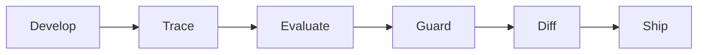
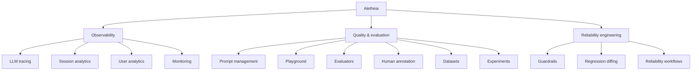
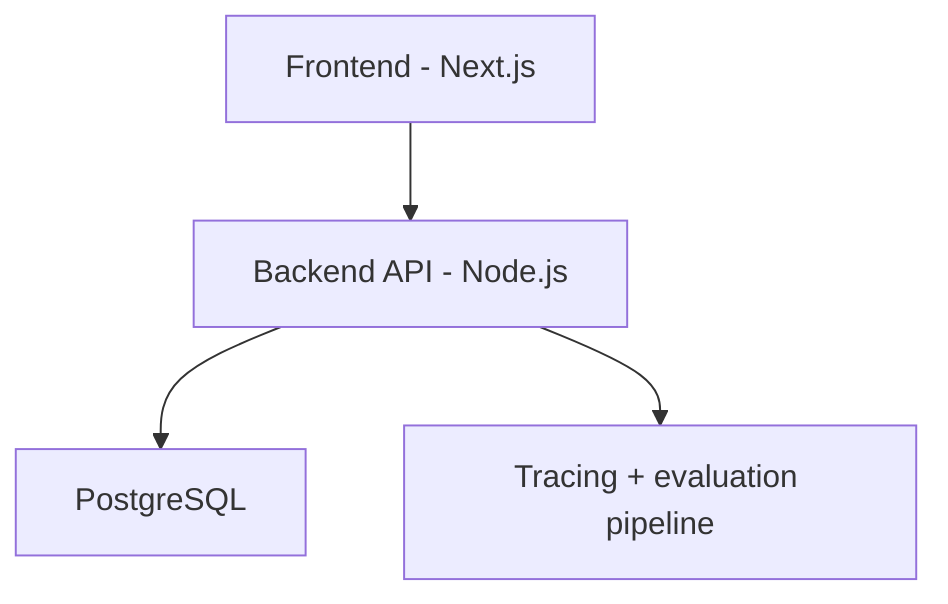
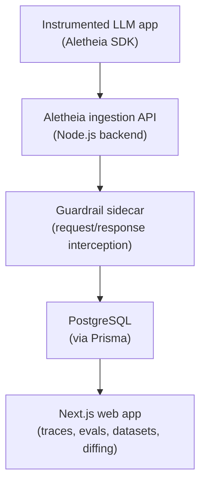

<div align="center">

<h1>Aletheia</h1>

<h3>AI Reliability, Evaluation, Monitoring & Observability Platform</h3>

<p>
  <strong>Trace. Evaluate. Guard. Ship reliably.</strong>
</p>

<p>
  <a href="#installation"><strong>Quickstart</strong></a> ·
  <a href="#architecture"><strong>Architecture</strong></a> ·
  <a href="#features"><strong>Features</strong></a> ·
  <a href="#key-improvements-over-base-platform"><strong>Engineering Highlights</strong></a> ·
  <a href="#diagrams"><strong>Diagrams</strong></a>
</p>

<p>
  
  
  
  
  
  <br/>
  
  
  
</p>

</div>

<br/>

> **Provenance note:** Aletheia is a customized, rebranded, and extended derivative of [Langfuse](https://github.com/langfuse/langfuse), an open-source LLM engineering platform. It is **not** the official Langfuse project, and is **not** affiliated with or endorsed by its maintainers. See [Acknowledgements](#acknowledgements) for full details on what was inherited versus engineered for this project.

---

## Table of Contents

- [Overview](#overview)
- [Features](#features)
- [Architecture](#architecture)
- [Key Improvements Over Base Platform](#key-improvements-over-base-platform)
- [Engineering Contributions](#engineering-contributions)
- [Diagrams](#diagrams)
- [Installation](#installation)
- [Deployment](#deployment)
- [Technical Skills Demonstrated](#technical-skills-demonstrated)
- [Acknowledgements](#acknowledgements)

---

## Overview

As LLM-powered applications move from prototypes to production, teams run into a recurring set of problems: prompts drift silently, retrieval pipelines fail without warning, model outputs regress after a "minor" model swap, and there's no structured way to catch any of it before users do.

Aletheia exists to close that gap. It gives engineering teams a single place to:

- **See** what their LLM application is actually doing, call by call, session by session.
- **Measure** output quality with automated and human-in-the-loop evaluation.
- **Catch regressions** before they ship, by diffing behavior across prompt, model, or code changes.
- **Enforce reliability** at runtime with guardrails that can intercept unsafe or malformed outputs.

The platform is designed around a simple idea: LLM reliability isn't a one-time check, it's a continuous workflow that spans development, testing, and production monitoring.



<p align="center"><em>Each release moves through this loop before reaching production.</em></p>

---

## Features



<br/>

| | Feature | Description |
|---|---|---|
| 🔍 | **LLM Tracing** | Full request/response capture for LLM calls, including nested spans for retrieval, embedding, tool calls, and agent steps. |
| 💬 | **Session Analytics** | Aggregate multi-turn conversations into sessions to analyze user journeys, drop-off points, and conversational quality over time. |
| 👤 | **User Analytics** | Per-user usage, cost, and quality breakdowns to identify high-friction or high-value usage patterns. |
| 📊 | **Monitoring** | Dashboards for latency, token usage, error rates, and cost, with drill-down into individual traces. |
| 📝 | **Prompt Management** | Centralized, version-controlled prompt storage with rollback and environment-based deployment. |
| 🧪 | **Playground** | Interactive environment to iterate on prompts and model parameters directly against traced examples. |
| ✅ | **Evaluators** | Pluggable evaluation pipeline supporting LLM-as-a-judge scoring, deterministic code-based checks, and custom scoring functions. |
| 🖋️ | **Human Annotation** | Manual labeling workflows for building ground-truth datasets and auditing model behavior. |
| 📂 | **Datasets** | Curated test sets for regression testing and benchmarking, decoupled from live production data. |
| 🔬 | **Experiments** | Structured experiment runs that compare outputs across prompt/model variants against a fixed dataset. |
| 🛡️ | **Guardrails** | A request-time sidecar layer that validates, filters, or blocks LLM inputs/outputs based on configurable policies — a core engineering addition in Aletheia (see below). |
| 🔁 | **Regression Diffing** | Side-by-side comparison of evaluation results across two versions of a prompt, model, or pipeline, surfacing behavioral drift before deployment. |
| ⚙️ | **Reliability Workflows** | Opinionated workflows that tie tracing, evaluation, and guardrails together into a single pre-deployment reliability check. |

---

## Architecture

<p align="center">
  
  
  
  
  
  
</p>

**Frontend**
- Next.js
- React
- TypeScript

**Backend**
- Node.js
- REST/internal APIs for trace ingestion, evaluation orchestration, and dataset management

**Database**
- PostgreSQL
- Prisma ORM

### High-Level Flow



### Detailed Request Flow



---

## Key Improvements Over Base Platform

Aletheia started from an open-source LLM observability codebase. The sections below distinguish what was inherited from the original foundation versus what was added, modified, or removed as part of this project.

### Rebranding
Full rebrand of naming, theming, and product identity — UI strings, color system, logos, and metadata were reworked so the platform stands on its own rather than reading as a fork.

### UI/UX Improvements
Simplified navigation for the reliability-focused workflows this project emphasizes, removed UI surface area tied to multi-tenant SaaS concerns, and reworked several views (trace detail, dataset comparison) for clarity.

### Removal of SaaS Billing Functionality
Stripped out subscription, billing, plan-gating, and usage-metering code paths that only made sense in a hosted multi-tenant SaaS context. This significantly reduced the codebase's operational surface area and made it suitable for a self-contained, single-tenant deployment.

### Reliability-Focused Workflows
Re-oriented the product around a "ship reliably" workflow rather than a general analytics dashboard — tying tracing, evaluation, and regression diffing into a single before-you-deploy checklist instead of three disconnected features.

### Guardrails (New)
Added a **guardrail sidecar proxy**: a lightweight interception layer that sits between the application and the LLM provider, capable of applying policy checks (e.g., schema validation, blocklist/allowlist filtering, basic safety heuristics) to requests and responses without modifying application code. This was not part of the original platform.

### Regression Testing / Diffing (New)
Built a **regression diffing engine** that compares evaluation scores and outputs across two versions of a prompt, model configuration, or pipeline run against the same dataset, surfacing deltas rather than requiring manual comparison.

### Cleanup of External Dependencies
Audited and removed dependencies tied to multi-tenant billing, telemetry reporting to third-party services, and SaaS-specific cloud integrations, reducing the dependency footprint for self-hosted, portfolio-scale deployment.

### Error Handling Improvements
Hardened ingestion and evaluation API paths with more defensive error handling, clearer failure states surfaced in the UI, and better handling of partial/malformed trace payloads.

### Platform Transformation
- Removed all upstream branding across UI, navigation, metadata, dialogs, documentation references, and settings pages.
- Removed external documentation redirects, support links, upgrade prompts, SaaS onboarding flows, and enterprise-oriented navigation.
- Eliminated billing and subscription-related UI components that caused runtime errors in self-hosted deployments.
- Simplified the platform into a portfolio-focused AI reliability engineering system.
- Refactored settings and navigation structures to better align with single-user, self-hosted deployments.
- Audited inherited dependencies and removed unnecessary SaaS-specific functionality.

> **Engineering note:** the original platform provided the core data model, tracing pipeline, and UI scaffolding. The contributions above — guardrails, regression diffing, the reliability-workflow restructuring, the platform transformation, and the dependency/billing cleanup — are the parts of this project I designed and implemented.

---

## Engineering Contributions

Key contributions made during the Aletheia transformation, summarized in resume-ready form:

- Re-architected a multi-tenant SaaS observability platform into a single-tenant, self-hosted reliability tool by removing billing, plan-gating, and usage-metering subsystems.
- Stripped all upstream branding, navigation, documentation links, and SaaS onboarding flows across the UI, replacing them with a streamlined, single-purpose product experience.
- Designed and implemented a **guardrail sidecar proxy** that intercepts LLM requests/responses at runtime and applies configurable validation, filtering, and safety policies without requiring changes to application code.
- Built a **regression diffing engine** that compares evaluation outputs and scores across two prompt, model, or pipeline versions against a shared dataset, surfacing behavioral drift before deployment.
- Restructured the product's information architecture around a "develop → trace → evaluate → guard → diff → ship" reliability workflow, replacing a general-purpose analytics dashboard layout.
- Audited and removed third-party telemetry, billing, and SaaS-specific cloud dependencies, reducing the dependency surface for self-hosted deployment.
- Hardened ingestion and evaluation API error handling to gracefully manage partial or malformed trace payloads.
- Executed a full rebrand across UI strings, theming, and metadata to establish an independent product identity distinct from the upstream codebase.

---

## Diagrams

> _No product screenshots are included — the platform's UI isn't deployed publicly. The diagrams below (rendered natively by GitHub via mermaid) illustrate the system's architecture and workflow instead. Once a live deployment exists, this section can be replaced with real screenshots of the trace detail view, evaluation dashboard, regression diff view, and guardrail configuration panel._

**System architecture**


**Reliability workflow**


---

## Installation

### Prerequisites
- Node.js (v18+)
- PostgreSQL (v14+)
- npm or pnpm

### Local Setup

```bash
# Clone the repository
git clone https://github.com/<your-username>/aletheia.git
cd aletheia

# Install dependencies
npm install

# Configure environment variables
cp .env.example .env
# Edit .env with your PostgreSQL connection string and other config

# Run database migrations
npx prisma migrate dev

# Start the development server
npm run dev
```

The app should now be running at `http://localhost:3000`.

### Docker (Optional)

```bash
docker compose up --build
```

---

## Deployment

### Self-Hosted (Single Server)

1. Provision a server with Node.js and PostgreSQL installed (or use a managed Postgres instance).
2. Set required environment variables (database URL, API keys, secret keys for auth).
3. Run `npx prisma migrate deploy` to apply migrations against the production database.
4. Build the production bundle: `npm run build`
5. Start the server: `npm run start`

### Containerized Deployment

A `Dockerfile` and Docker Compose configuration are included for containerized deployment to any environment supporting Docker (e.g., a VM, ECS, or a Kubernetes cluster via a Helm chart if you choose to extend one).

```bash
# Standard deployment
docker compose up -d

# If you maintain a separate production compose file, reference it explicitly:
# docker compose -f docker-compose.<your-prod-file>.yml up -d
```

> Check the repository root for the exact compose file names available (e.g. `docker-compose.yml`, `docker-compose.dev.yml`) and adjust the command above accordingly — file names vary by environment and may be renamed as the project evolves.

> This project is intended for self-hosted, single-tenant use. No cloud-hosted "Aletheia Cloud" offering, billing system, or managed service exists — those concerns were intentionally removed (see [Key Improvements](#key-improvements-over-base-platform)).

---

## Technical Skills Demonstrated

| | Skill | Applied On This Project |
|---|---|---|
| 🧱 | **Full Stack Development** | Next.js/React/TypeScript frontend integrated with a Node.js backend and PostgreSQL persistence layer. |
| 🤖 | **AI Infrastructure** | Designed and implemented a guardrail sidecar for runtime LLM request/response interception. |
| 📡 | **Observability Systems** | Worked with distributed tracing concepts (spans, nested observations, session aggregation) applied to LLM call graphs. |
| 🗄️ | **Database Design** | Modified and extended a Prisma/PostgreSQL schema to support new evaluation and regression-diffing data models. |
| 🔌 | **API Development** | Built and hardened ingestion and evaluation APIs, including error handling for malformed/partial payloads. |
| 🏗️ | **System Design** | Re-architected parts of the platform to remove multi-tenant SaaS coupling and re-orient it around a single-tenant reliability workflow. |
| 🐛 | **Debugging** | Diagnosed and resolved issues introduced by large-scale removal of billing/telemetry code paths without breaking core tracing functionality. |
| 🎯 | **Product Engineering** | Made deliberate scope, UX, and architecture decisions to reposition a general observability tool as a focused reliability platform. |

---

## Acknowledgements

Aletheia is built upon [Langfuse](https://github.com/langfuse/langfuse), an open-source LLM engineering platform, and has been customized and extended for educational, portfolio, and research purposes. The original codebase provided the foundational tracing pipeline, data model, and UI scaffolding; the architecture, feature additions (guardrails, regression diffing), rebranding, platform transformation, and reliability-workflow restructuring described in this README are my own work.

This project is not affiliated with, endorsed by, or representative of Langfuse or its maintainers. No original Langfuse branding, trademarks, or marketing content are used here.

---

## License

This project is derived from [Langfuse](https://github.com/langfuse/langfuse), an open-source LLM engineering platform.

```
Original copyright:
Copyright (c) 2022–2026 Langfuse GmbH

Licensed under the MIT License.

Additional modifications and extensions for Aletheia:
Copyright (c) 2026 Jayanth
```

See [`LICENSE`](LICENSE) for the full MIT License text, including the original copyright notice as required by its terms.

<br/>

<div align="center">
  <sub>Built by Jayanth · Portfolio Project · Not affiliated with the original upstream project</sub>
  <br/><br/>
  
  
</div>
